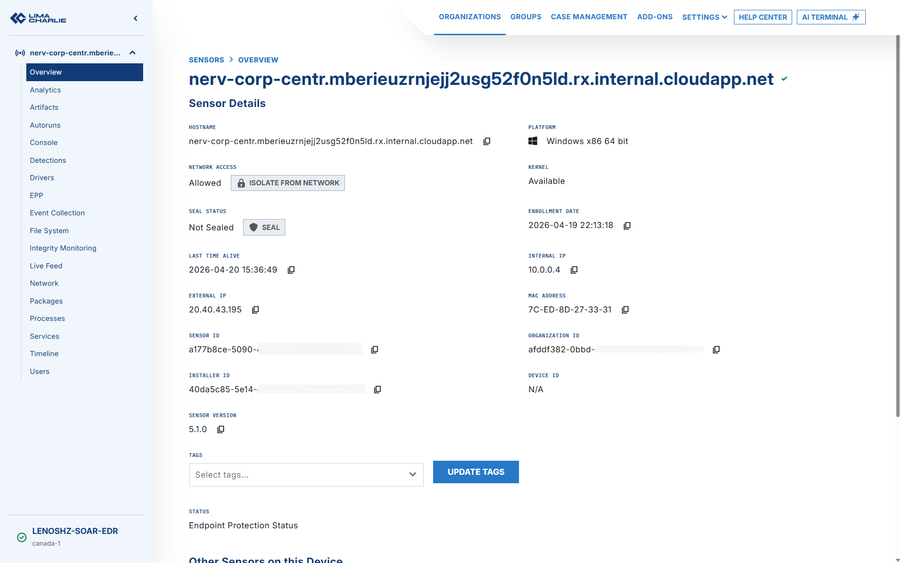
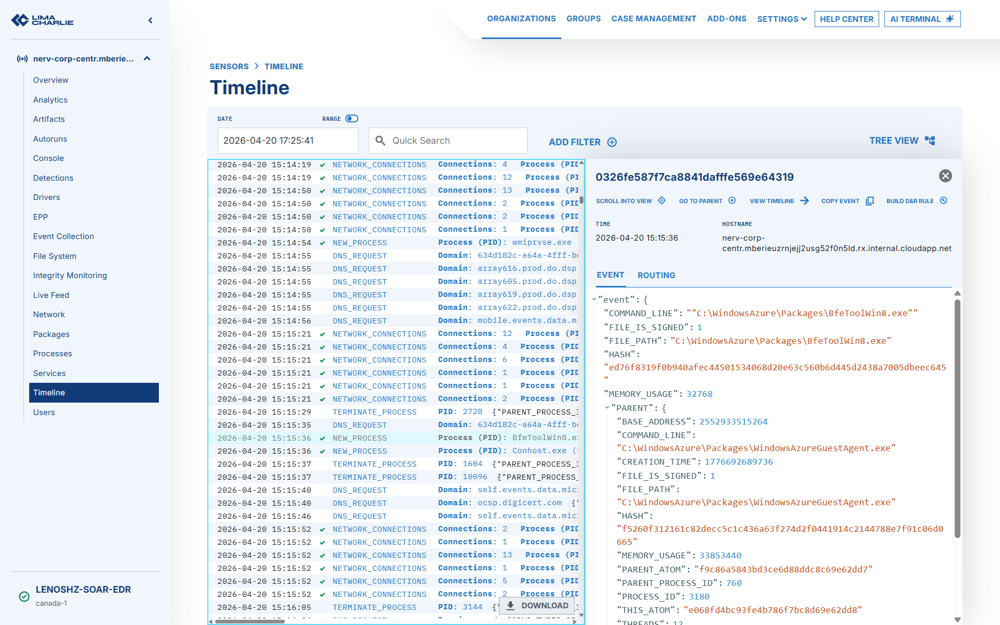
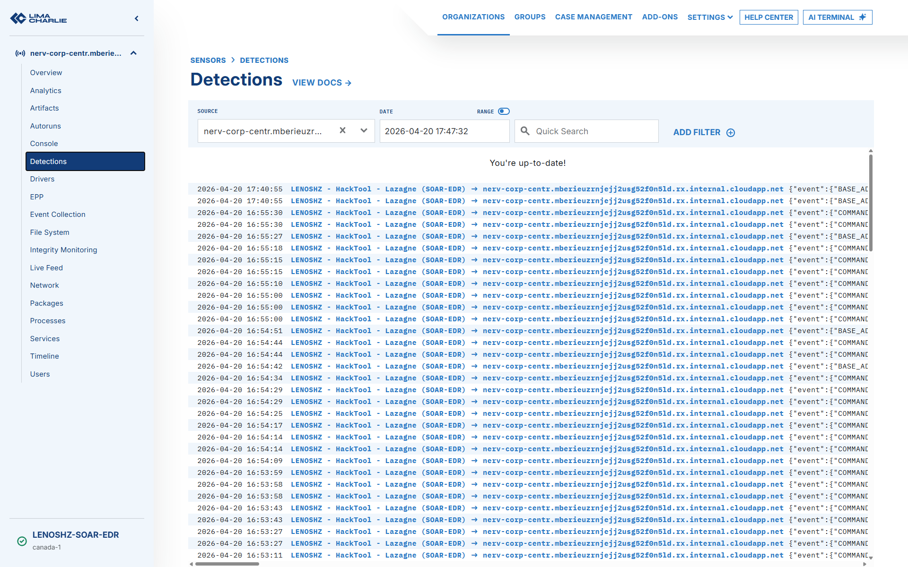
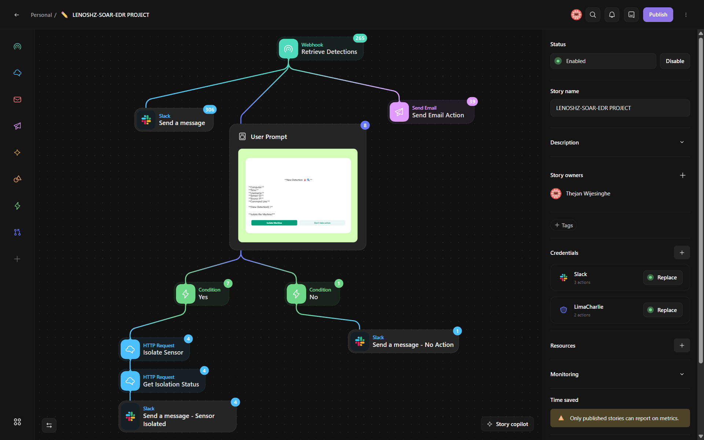
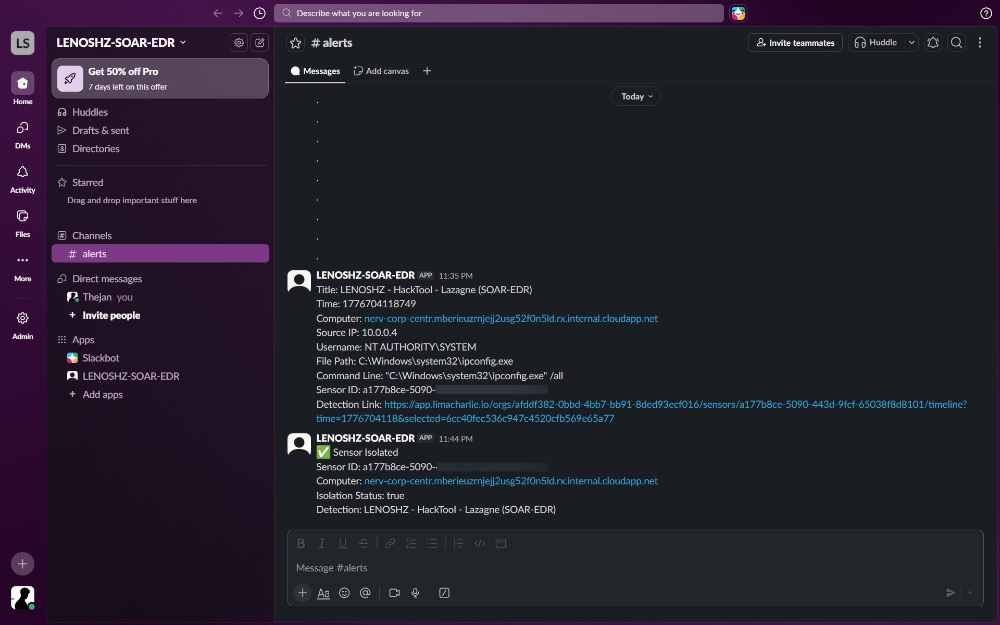
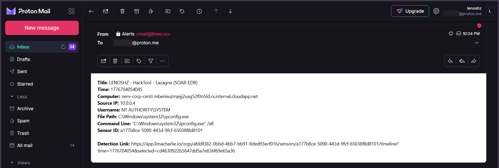
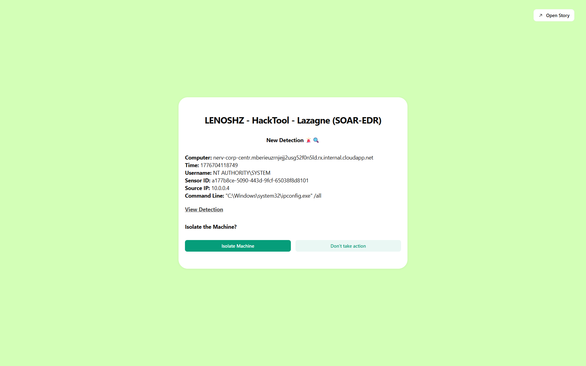
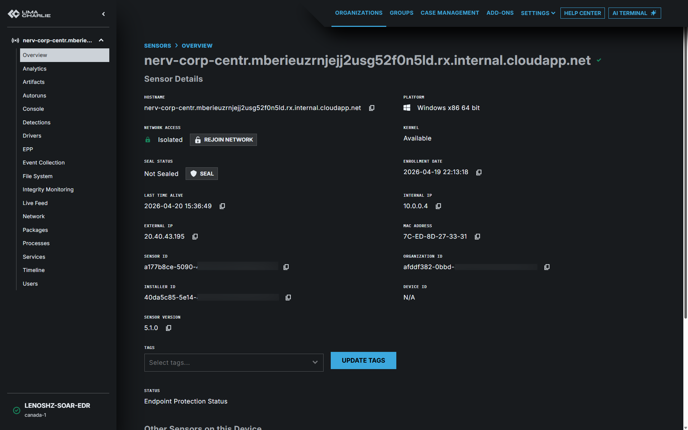

# 🛡️ SOAR + EDR Automated Incident Response Lab


> **A fully automated threat detection and response pipeline** from a credential-harvesting attack on a Windows endpoint all the way to analyst notification, decision prompt, and automatic machine isolation. Built using **LimaCharlie** (EDR), **Tines** (SOAR), **Slack**, and **Proton Mail**.

---

## Project Overview

Modern Security Operations Centers (SOCs) rely on SOAR platforms to reduce alert fatigue and respond to threats faster than any human team could manually. This project brings that concept to life in a hands-on lab environment.

The scenario simulates a real-world credential theft attack using **LaZagne** - a widely-known password recovery tool - running on a Windows 10 Enterprise endpoint. The full pipeline, from detection to automated response, runs without manual intervention unless an analyst makes an isolation decision.

**This project demonstrates:**
- Deploying and configuring a cloud-hosted Windows endpoint
- Installing and enrolling an EDR agent (LimaCharlie)
- Writing custom Detection & Response (D&R) rules in YAML
- Building a multi-step SOAR automation story in Tines
- Integrating Slack and email for real-time analyst alerting
- Automating endpoint isolation via API based on analyst input

---

## Architecture


---

## Tools & Technologies

| Tool | Role | Purpose |
|---|---|---|
| **LimaCharlie** | EDR Platform | Real-time endpoint telemetry, detection rules, machine isolation API |
| **Tines** | SOAR Platform | Automated workflow orchestration (no-code story builder) |
| **LaZagne** | Attack Simulation | Open-source credential harvesting tool used to trigger detections |
| **Slack** | Alerting | Real-time channel notifications sent to the analyst |
| **Email (Proton Mail)** | Alerting | Full detection detail emails to analyst inbox |
| **Azure** | Cloud Infrastructure | Hosted the Windows 10 Enterprise target endpoint |
| **Windows 10 Enterprise** | Target Endpoint | Machine enrolled in LimaCharlie for monitoring |

---

## What Was Built

### 1. Cloud Endpoint Setup
- Provisioned a **Windows 10 Enterprise** VM on **Azure**
- Configured network access and remote console connectivity

### 2. EDR Agent Enrollment (LimaCharlie)
- Created an organisation and generated an installation key in LimaCharlie
- Downloaded and silently installed the Windows 64-bit sensor via PowerShell
- Confirmed the agent appeared as **Connected** in the LimaCharlie dashboard

### 3. Attack Simulation - LaZagne
- Downloaded **LaZagne v2.4 (lazagne.exe)** on the target endpoint
- Executed it from PowerShell to simulate credential theft
- Confirmed telemetry appeared in LimaCharlie's **Timeline** as a `NEW_PROCESS` event

### 4. Custom Detection & Response Rule
Wrote a YAML-based D&R rule in LimaCharlie to detect LaZagne execution:

```yaml
events:
  - NEW_PROCESS
  - EXISTING_PROCESS
op: and
rules:
  - op: is windows
  - op: or
    rules:
      - case sensitive: false
        op: ends with
        path: event/FILE_PATH
        value: lazagne.exe
      - case sensitive: false
        op: contains
        path: event/COMMAND_LINE
        value: lazagne
      - case sensitive: false
        op: is
        path: event/HASH
        value: 3cc5ee93a9ba1fc57389705283b760c8bd61f35e9398bbfa3210e2becf6d4b05

- action: report
  metadata:
    author: lenoshz
    description: Detects LaZagne (SOAR-EDR Tool)
    falsepositives:
      - Legitimate security testing by authorised pen testers
      - IT administrators auditing stored credentials on corporate assets
    level: medium
    tags:
      - attack.credential_access
      - attack.t1555
  name: lenoshz - HackTool - LaZagne (SOAR-EDR)
```

Tested the rule against a captured timeline event using LimaCharlie's built-in rule tester before deploying.

### 5. LimaCharlie to Tines Integration
- Configured a **Webhook Output** in LimaCharlie to forward all detection alerts to Tines in real time

### 6. Tines SOAR Story (Playbook)
Built a multi-action Tines story that:

1. **Receives** the LimaCharlie webhook payload
2. **Parses** key fields: computer name, source IP, file path, command line, sensor ID, detection link
3. **Sends a Slack message** to `#alerts` with full detection context
4. **Sends an email alert** with formatted detection details
5. **Presents an analyst prompt** - "Do you want to isolate this machine? YES / NO"
6. If **YES**: sends a `POST` request to the LimaCharlie isolation API endpoint - machine is network-isolated immediately
7. If **NO**: sends a follow-up Slack message confirming no action was taken and logging the decision

### 7. Endpoint Isolation Verified
- Confirmed that after selecting **YES** in the Tines prompt, the Windows VM lost network connectivity
- LimaCharlie dashboard reflected the machine status as **Isolated**
- Follow-up Slack notification confirmed the isolation action

---

## 📸 Screenshots

### LimaCharlie Sensor Enrolled


### LaZagne Telemetry in Timeline


### D&R Rule Detection Fired


### Tines Story (Playbook)


### Slack Alert Received


### Email Alert Received


### Analyst Isolation Prompt


### Machine Isolated in LimaCharlie


---

## Concepts in this project

- **Security Operations** - Understanding of SOC workflows, alert triage, and incident escalation
- **EDR Configuration** - Sensor deployment, telemetry analysis, and custom rule authoring
- **SOAR Development** - No-code automation story design with conditional branching
- **API Integration** - Webhook configuration and REST API calls for automated isolation
- **Threat Detection Logic** - Writing detection rules using process events, file paths, command-line patterns, and file hashes
- **Cloud Infrastructure** - VM provisioning and management on Azure
- **Incident Response** - End-to-end automated playbook from detection to containment

---

## Repository Structure

```
soar-edr-project/
│
├── README.md
├── detection-rule.yml
└── images/
    ├── architecture-diagram
    └── screenshots/
```
